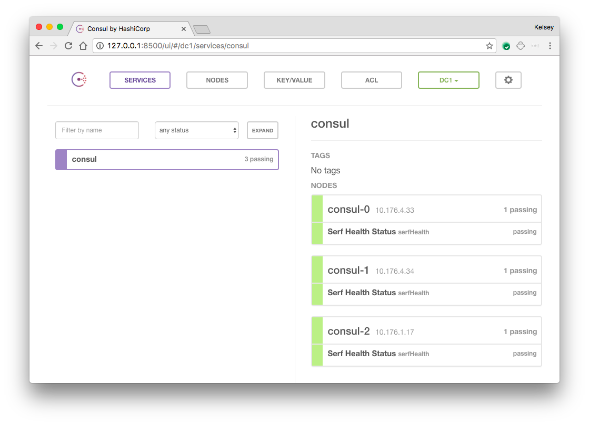

# Running Consul on Kubernetes

This tutorial will walk you through deploying a three (3) node [Consul](https://www.consul.io) cluster on Kubernetes.

## Overview

* Three (3) node Consul cluster using a [StatefulSet](http://kubernetes.io/docs/concepts/abstractions/controllers/statefulsets)
* Secure communication between Consul members using [TLS and encryption keys](https://www.consul.io/docs/agent/encryption.html)

## Prerequisites

This tutorial leverages features available in Kubernetes 1.6.0 and later.

* [kubernetes](http://kubernetes.io/docs/getting-started-guides/binary_release) 1.7.x

The following clients must be installed on the machine used to follow this tutorial:

* [consul](https://www.consul.io/downloads.html) 0.9.0
* [cfssl](https://pkg.cfssl.org) and [cfssljson](https://pkg.cfssl.org) 1.2

## Usage

Clone this repo:

```
git clone https://github.com/kelseyhightower/consul-on-kubernetes.git
```

Change into the `consul-on-kubernetes` directory:

```
cd consul-on-kubernetes
```

### Generate TLS Certificates

RPC communication between each Consul member will be encrypted using TLS. Initialize a Certificate Authority (CA):

```
cfssl gencert -initca ca/ca-csr.json | cfssljson -bare ca
```

Create the Consul TLS certificate and private key:

```
cfssl gencert \
  -ca=ca.pem \
  -ca-key=ca-key.pem \
  -config=ca/ca-config.json \
  -profile=default \
  ca/consul-csr.json | cfssljson -bare consul
```

At this point you should have the following files in the current working directory:

```
ca-key.pem
ca.pem
consul-key.pem
consul.pem
```

### Generate the Consul Gossip Encryption Key

[Gossip communication](https://www.consul.io/docs/internals/gossip.html) between Consul members will be encrypted using a shared encryption key. Generate and store an encrypt key:

```
GOSSIP_ENCRYPTION_KEY=$(consul keygen)
```

### Create the Consul Secret and Configmap

The Consul cluster will be configured using a combination of CLI flags, TLS certificates, and a configuration file, which reference Kubernetes configmaps and secrets.

Store the gossip encryption key and TLS certificates in a Secret:

```
kubectl create secret generic consul \
  --from-literal="gossip-encryption-key=${GOSSIP_ENCRYPTION_KEY}" \
  --from-file=ca.pem \
  --from-file=consul.pem \
  --from-file=consul-key.pem
```

Store the Consul server configuration file in a ConfigMap:

```
kubectl create configmap consul --from-file=configs/server.json
```

### Create the Consul Service

Create a headless service to expose each Consul member internally to the cluster:

```
kubectl create -f services/consul.yaml
```

### Create the Consul StatefulSet

Deploy a three (3) node Consul cluster using a StatefulSet:

```
kubectl create -f statefulsets/consul.yaml
```

Each Consul member will be created one by one. Verify each member is `Running` before moving to the next step.

```
kubectl get pods
```
```
NAME       READY     STATUS    RESTARTS   AGE
consul-0   1/1       Running   0          50s
consul-1   1/1       Running   0          29s
consul-2   1/1       Running   0          15s
```

### Verification

At this point the Consul cluster has been bootstrapped and is ready for operation. To verify things are working correctly, review the logs for one of the cluster members.

```
kubectl logs consul-0
```

The consul CLI can also be used to check the health of the cluster. In a new terminal start a port-forward to the `consul-0` pod.

```
kubectl port-forward consul-0 8400:8400
```
```
Forwarding from 127.0.0.1:8400 -> 8400
Forwarding from [::1]:8400 -> 8400
```

Run the `consul members` command to view the status of each cluster member.

```
consul members
```
```
Node      Address           Status  Type    Build  Protocol  DC
consul-0  10.176.4.30:8301  alive   server  0.7.2  2         dc1
consul-1  10.176.4.31:8301  alive   server  0.7.2  2         dc1
consul-2  10.176.1.16:8301  alive   server  0.7.2  2         dc1
```

### Accessing the Web UI

The Consul UI does not support any form of authentication out of the box so it should not be exposed. To access the web UI, start a port-forward session to the `consul-0` Pod in a new terminal.

```
kubectl port-forward consul-0 8500:8500
```

Visit http://127.0.0.1:8500 in your web browser.



## Cleanup

Run the `cleanup` script to remove the Kubernetes resources created during this tutorial:

```
bash cleanup
```
